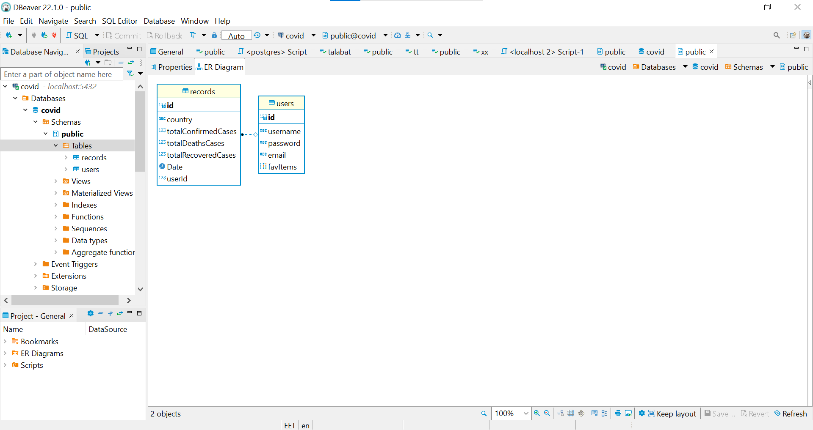

# covid-19
Building-a-server

## Deploy Link 
[Railway Covid-19 ](https://covid-19-production.up.railway.app/)

## Configuration
Configure the root of your repository with the following files and directories. Thoughfully name and organize any aditional configuration or module files.

- README.md - contains documentation

- .env - contains env variables (should be git ignored)

- .gitignore - contains a .gitignore file

- package.json - contains npm package config

- index.js - the entry point for your application

- src/ - contains your core application files and folders

- package.json - contains npm package config

## Dependencies
- base-64

- bcrypt

- cors

- dotenv

- express

- jsonwebtoken

- morgan

- nodemon

- pg

- sequelize

- sequelize-cli

- sqlite3

- supertest

- jest

## Auth Routes
| **method** | **link**       | **Description**                         |
| ---------- | -------------- | --------------------------------------- |
| POST       | /signup        | Signup                                  |
| POST       | /signin        | Signin                                  |
| PUT        | /updateRecord | Delete user recored                     |
| DELETE     | /deleteRecord | Update user recored                     |
| GET        | /users         | Get all users for admin                 |
| GET        | /secret        | Get The token and description for users |

## Installation

- covid-19 requires Node.js v14+ to run.

- Install the dependencies and devDependencies and start the server.

1. cd covid-19

2. npm i

3. npm start

## ER Diagram

 

 

##  For production environments...

1. npm install --production

2. NODE_ENV=production node index

 

## License

MIT